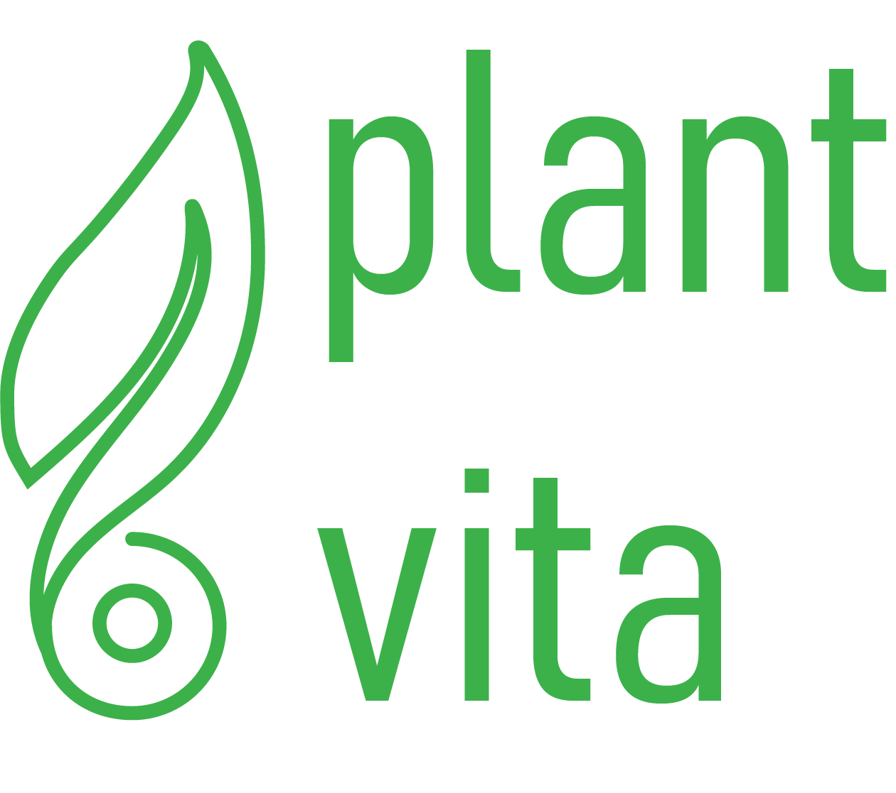

# **Plant-Vita**

## **Project Overview**

Plant-Vita is a comprehensive "Smart Gardener" system designed to automate domestic plant care through the integration of Internet of Things (IoT), Cloud Computing, and Artificial Intelligence. The system transitions plant maintenance from a passive, manual task to an active, data-driven process. By employing a network of sensors and intelligent processing, Plant-Vita ensures optimal plant health through continuous environmental monitoring, automated irrigation, and proactive disease detection.

## **Functional Description**

The system operates on a closed-loop architecture that regulates plant environments without human intervention. The core workflow involves the following stages:

- **Environmental Monitoring:** A suite of sensors continuously tracks critical metrics, including soil moisture (at both surface and root levels), ambient temperature, humidity, atmospheric pressure, and light intensity (DLI).
- **Automated Irrigation:** The system utilizes a hysteresis-based control algorithm to manage soil moisture. A submersible water pump is automatically activated when moisture levels drop below a specific threshold and deactivated once the target saturation is reached, preventing both dehydration and root rot.
- **AI-Powered Diagnostics:** An integrated camera module captures periodic high-resolution images of the plant. These images are processed using computer vision to quantify physical growth (green pixel density) and analyzed by Generative AI to identify symptoms of common plant diseases or nutrient deficiencies.
- **Remote Management:** Users interact with the system via a cross-platform dashboard. This interface provides real-time data visualization, historical logs, health diagnosis reports, and manual override controls for the actuation system.

## **System Architecture**

The technical infrastructure follows a hub-and-spoke model, ensuring robust communication between edge devices and the user interface.

1. [**Hardware Layer:**](embedded/README.md) The physical node consists of an ESP32 microcontroller serving as the central processing unit, interfacing with capacitive soil sensors, environmental sensors, and an ESP32-CAM module.
2. [**Backend Infrastructure:**](backend/README.md) A central server acts as the message broker and logic handler. It manages MQTT communication for real-time telemetry, processes API requests, and stores time-series data and image history in a relational database.
3. [**Intelligence Layer:**](processing_service/README.md) Raw data is processed into actionable insights using cloud-based inference for disease diagnosis and local algorithms for growth tracking.
4. [**Application Layer:**](frontend/README.md) A unified frontend application allows users to manage plant profiles, view analytical graphs, and receive critical status alerts.

## **Technology Stack**

**Hardware & Firmware**

- **Microcontroller:** ESP32, ESP32-CAM
- **Sensors:** Capacitive Soil Moisture, Digital Light (Lux), Environmental (Temp/Humidity/Pressure)
- **Language:** C++ (Arduino Framework)

**Backend & Cloud**

- **Framework:** FastAPI (Python)
- **Database:** PostgreSQL
- **Protocols:** MQTT, REST, WebSocket
- **Storage:** Cloud Storage for image archiving

**Frontend Application**

- **Mobile:** Jetpack Compose
- **Web:** React.js
- **State Management:** TanStack Query

**Artificial Intelligence**

- **Vision Analysis:** Google Gemini API
- **Image Processing:** OpenCV
